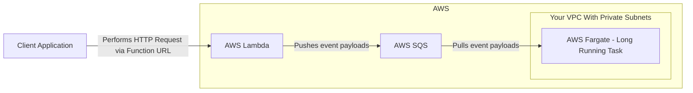

# Simple Ingestion Pipeline Template

This is a relatively simple implementation of an API fronting
and ingestion pipeline that performs asyncronous work for any
given request.

It can be run either on AWS or locally via the [Go Cloud SDK](https://gocloud.dev/).

## Cut to the chase, is it good?
🦄 Hell Yeah! 🚀 This is the template *I* want every time this problem comes up.

## Problem

Often, while discussing possible solutions for various problems a common
pattern is brought up: We need something Lambda-like, but can do work for
a long period of time without interruption without keeping Lambda alive.
This generally boils-down to Lambda dumping a payload into SQS, which a
AWS Fargate Task can pick up and perform the work without being interrupted.

The largest barrior to implementing such a solution is often:
 * Implementing it in a timely manor
   * Every time I've had to reinvent this at a new organisation,
     I have been unable to reference previous details and this results
     in restarting a lot of the detail work from scratch
 * Lack of completeness in off-the-shelf options/samples
   * Many examples online leave out details and don't get past the
     most basic 'Hello, World!' implementation which don't address
     larger questions.
   * How do I tie in mature dependency injection into the solution?
   * How do I actually refactor common types and functions between the
     ingestion Lambda and the consuming Fargate worker?
   * How do I expand this or incorporate it into my current architecture?
     How does this get from my machine into a target environment?

## Dependencies
You will need to install the following for your machine

### Running Justfile commands
- [Just](https://github.com/casey/just)
  - A language agnostic command runner

### Building and Testing
- [Docker](https://docs.docker.com/desktop/)
  - You will need to follow the Docker Desktop installation instructions
    for your specific OS.
  - When deploying to AWS, the AWS CDK will build your containers locally first
  - When running locally, docker compose will build your stack and run them
- [GoLang](https://go.dev/doc/install)
- [Wire](https://github.com/google/wire)
  - Compile time dependency injection. Used to switch AWS and local implementations

### Deploying to AWS via [AWS CDK](https://aws.amazon.com/cdk/)

> The AWS CDK is analagous to Terraform except being declarative,
> your Infrastructure-as-Code is done with a supported language of
> your choosing. In this case, it is GoLang to keep the project
> homogenous and lessen the cognative-load needed to understand
> this repository.

- [AWS CLI](https://docs.aws.amazon.com/cli/latest/userguide/getting-started-install.html)
  - You must configure your machine for development with AWS if you want to deploy this to AWS
- NodeJS
  - I personally find [the fnm project](https://github.com/Schniz/fnm) to be reliable and portable node version manager
  - Alternatively [nvm](https://github.com/nvm-sh/nvm) is popular

You will need a VPC with Private (not just Isolated) Subnets. If you do not have
one, you can deploy a sample I've written:
 - [simple-private-vpc-template](https://github.com/niko-dunixi/simple-private-vpc-template)

## Running, Testing, Deploying

The fastest way to get things up and running:

## Running locally

`$ just local`
 * This will build the stack with the dependencies from [`docker-compose.yaml`](./docker-compose.yaml)
 * It is faster to interate changes locally, this is the recommended way to get started

## Running in AWS

`$ just bootstrap`
 * This is necessary the first time you use the CDK with your AWS account
 * It is only needed once, you don't need to run it ever again

`$ just deploy`
 * Will synthesize the CloudFormation template and deploy it to your account

`$ just destroy`
 * Will tear down and delete all the resources created when you deployed
 * Be sure to do this when you no longer need your VPC, the VPC Endpoints will incur costs

## House keeping

`$ just tidy`
 * This will run `go mod tidy` upon all sub directories

`$ just fmt`
 * Will run `go fmt` upon all sub directories